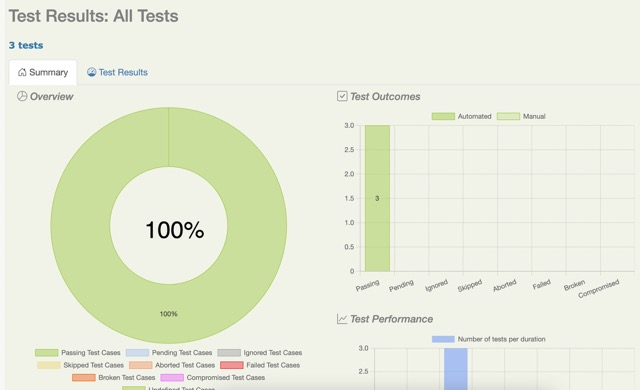
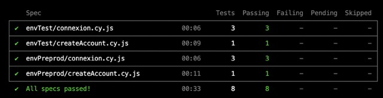

# Rapport d'exécution des tests sur OPEN CRUISE

Les tests automatisés (voir le document AUTOMATISATION.md) sont exécuté tous les jours, deux fois par jour.

## Informations générales

Dans le cadre du projet Open Cruise, j'ai réalisé des tests pour évaluer la fonctionnalité de connexion utilisateur. LEs tests ont été effectués sur deux environnements suivants:

## Environnement Préproduction:
- https://opencruise-ok.sogeti-center.cloud (version V1.1.0 de l'application)
Cet environnement est considéré comme stable sans anomalies majeures

## Environnement Test:
- https://opencruise-ko.sogeti-center.cloud (nouvelle version V1.2.0 de l'application à qualifier)
Cet environnement comporte plusieurs bugs connus

## Résultats des tests automatisés:

## Anomalies identifiées:

**Les anomalies suivantes ont été détectées sur l'environnement Test:**
1. Lors de la validation de la création de compte particulier/professionnel un message d'erreur s'affiche "Erreur technique"
   
**Les anomalies suivantes ont été détectées sur les environnements Préproduction et Test:**
1. Le champ "Date de naissance" permet de sélectionner les dates ultérieures à la date du jour ainsi que les dates trop anciennes
2. Les champs "Nom" et "Prénom" permettent la saisie des chiffres et de caractères spéciaux (pas de message d'erreur)
3. Le champ "Email" permet la saisie des noms de domaines inexistants et au format invalide (pas de message d'erreur)

## Conclusion

Ne comportant pas d'anomalies identifiées les tests réalisés sur l'environnement Préproduction permettent de vérifier quotidiennement le bon fonctionnement de la connexion utilisateur

L'environnement Test comporte à ce jour de nombreux bugs cités dans le paragraphe "Anomalies identifiées" ci-dessus

## Etat actuel:

Tous les bugs ont été signalés à l'équipe de développement et sont en cours de débogage 

<body>
